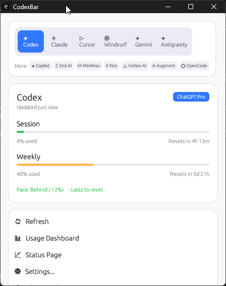

# Win-CodexBar - Windows Port of CodexBar

A Windows port of [CodexBar](https://github.com/steipete/CodexBar) - the tiny menu bar app that keeps your AI provider usage limits visible.

> **This is an unofficial Windows port.** The original CodexBar is a macOS Swift app by [Peter Steinberger](https://github.com/steipete). This port is built with Rust + egui for native Windows support.

## Features

- **15 AI Providers**: Codex, Claude, Cursor, Gemini, Copilot, Antigravity, Windsurf, Zed AI, Kiro, Vertex AI, Augment, MiniMax, OpenCode, Kimi, Kimi K2
- **System Tray Icon**: Dynamic two-bar meter showing session + weekly usage
- **Native Windows UI**: Built with egui - no web runtime required
- **Browser Cookie Extraction**: Automatic extraction from Chrome, Edge, Brave, Firefox (DPAPI encrypted)
- **CLI Commands**: `codexbar usage` and `codexbar cost` for scripting
- **Preferences Window**: Enable/disable providers, set refresh intervals, manage cookies

## Screenshot



## Install

### Download
Download the latest release from [GitHub Releases](https://github.com/Finesssee/Win-CodexBar/releases).

### Build from Source
```bash
cd rust
cargo build --release
# Binary at: target/release/codexbar.exe
```

## Usage

### GUI (System Tray)
```bash
codexbar menubar
```

### CLI
```bash
# Check usage for a provider
codexbar usage -p claude
codexbar usage -p codex
codexbar usage -p all

# Check local cost usage (from JSONL logs)
codexbar cost -p codex
codexbar cost -p claude
```

## Providers

| Provider | Auth Method | What's Tracked |
|----------|-------------|----------------|
| Codex | OAuth / CLI | Session, Weekly, Credits |
| Claude | OAuth / Cookies / CLI | Session (5h), Weekly |
| Cursor | Browser Cookies | Plan, Usage, Billing |
| Gemini | OAuth (gcloud) | Quota |
| Copilot | GitHub Device Flow | Usage |
| Antigravity | Local Language Server | Usage |
| Windsurf | Local Config | Usage |
| Zed AI | API Token | Quota |
| Kiro | CLI | Monthly Credits |
| Vertex AI | gcloud OAuth | Cost Tracking |
| Augment | Browser Cookies | Credits |
| MiniMax | API | Usage |
| OpenCode | Local Config | Usage |
| Kimi | Browser Cookies | 5-Hour Rate, Weekly |
| Kimi K2 | API Key | Credits |

## First Run

1. Run `codexbar menubar` to start the app
2. Click **Settings** in the menu
3. Go to **Providers** tab and enable the providers you use
4. Make sure you're logged into the provider CLIs (e.g., `codex`, `claude`, `gemini`)

## Browser Cookie Extraction

Win-CodexBar automatically extracts cookies from:
- **Chrome** (DPAPI + AES-256-GCM)
- **Edge** (DPAPI + AES-256-GCM)
- **Brave** (DPAPI + AES-256-GCM)
- **Firefox** (unencrypted SQLite)

For providers that need web authentication (Claude, Cursor, Kimi), cookies are extracted automatically when you're logged into the web interface.

### Manual Cookies

If automatic extraction fails, you can add cookies manually:
1. Go to **Settings** → **Cookies** tab
2. Select the provider
3. Paste the cookie header from browser DevTools (F12 → Network → Request Headers → Cookie)

## Differences from macOS Version

| Feature | macOS | Windows |
|---------|-------|---------|
| UI Framework | SwiftUI | egui (Rust) |
| System Tray | NSStatusItem | tray-icon crate |
| Cookie Decryption | Keychain | DPAPI |
| Widget | WidgetKit | Not available |
| Auto-update | Sparkle | Manual |

## Privacy

- **No disk scanning**: Only reads known config locations and browser cookies
- **On-device only**: No data sent to external servers (except provider APIs)
- **Cookies are opt-in**: Browser cookie extraction only happens for enabled providers

## Credits

- **Original CodexBar**: [steipete/CodexBar](https://github.com/steipete/CodexBar) by Peter Steinberger (MIT)
- **Inspired by**: [ccusage](https://github.com/ryoppippi/ccusage) for cost tracking

## License

MIT - Same as original CodexBar

---

*This is an unofficial Windows port. For the official macOS version, visit [steipete/CodexBar](https://github.com/steipete/CodexBar).*
